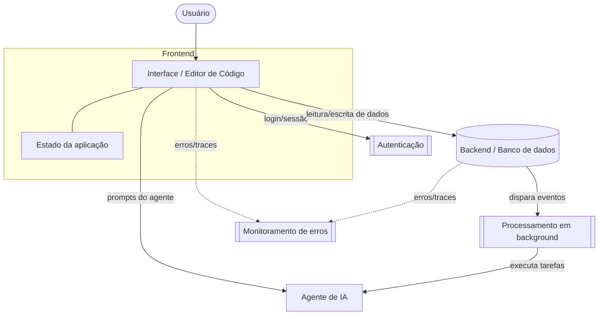

# Nightcode

> Editor de código / IDE assistido por IA no navegador — construído com foco em produtividade, edição em tempo real e um agente de IA integrado ao fluxo de desenvolvimento.


## Sobre o projeto

**Nightcode** é uma aplicação que reproduz a experiência de um editor/IDE de código moderno, com um agente de IA integrado para ajudar o desenvolvedor a escrever, revisar e entender código mais rápido. Este README foi construído seguindo o mesmo padrão usado no projeto irmão **[nextjs-polaris](https://github.com/renatomf/nextjs-polaris)**.

> ⚠️ **Nota de transparência:** não consegui acessar automaticamente o conteúdo do repositório `renatomf/nightcode` (o GitHub retornou 404 para o meu acesso, mesmo com o repositório público). Por isso, esta versão do README é um **template estrutural** — a seção de arquitetura, stack e funcionalidades abaixo está com placeholders para você preencher com os dados reais (`package.json`, pastas do projeto, etc.). Assim que você colar essas informações aqui no chat, eu atualizo o arquivo com os detalhes exatos do seu projeto.

## Principais funcionalidades

- [ ] _Preencher: ex. editor de código com syntax highlighting_
- [ ] _Preencher: ex. agente de IA para chat/geração de código_
- [ ] _Preencher: ex. autenticação de usuários_
- [ ] _Preencher: ex. persistência de projetos/arquivos_
- [ ] _Preencher: ex. execução de código / preview em tempo real_

## Tech Stack

| Camada | Tecnologia |
|---|---|
| Framework | _preencher (ex. Next.js, Vite, etc.)_ |
| UI | _preencher_ |
| Editor de código | _preencher (ex. CodeMirror, Monaco)_ |
| IA | _preencher (ex. AI SDK + provider)_ |
| Backend / dados | _preencher_ |
| Autenticação | _preencher_ |
| Linguagem | _preencher_ |

## Arquitetura



**Como funciona o fluxo (placeholder — ajustar com a implementação real):**

1. O usuário interage com a interface do editor no navegador.
2. A camada de **autenticação** protege sessões e rotas.
3. O **backend** persiste dados (arquivos, projetos, histórico) e sincroniza com o cliente.
4. Tarefas mais pesadas ou assíncronas são delegadas a um **processador em background**.
5. O **agente de IA** processa prompts do usuário e pode acionar ferramentas externas.
6. Erros e métricas de todas as camadas são reportados a uma ferramenta de **monitoramento**.

> Assim que você me passar o `package.json` e a estrutura de pastas reais do `nightcode`, eu troco esse diagrama genérico por um específico — com os nomes reais das tecnologias e as setas refletindo o fluxo de dados real do projeto.

## Estrutura do projeto

```
nightcode/
├── (preencher com as pastas reais do repositório)
├── package.json
└── README.md
```

## Pré-requisitos

- Node.js (versão a confirmar)
- Gerenciador de pacotes: `npm`, `yarn`, `pnpm` ou `bun`
- Contas/chaves de API necessárias (a confirmar conforme integrações do projeto)

## Variáveis de ambiente

```bash
# Preencher com as variáveis reais usadas pelo projeto
```

## Instalação e execução local

```bash
# 1. Clone o repositório
git clone https://github.com/renatomf/nightcode.git
cd nightcode

# 2. Instale as dependências
npm install

# 3. Configure o .env.local (veja seção acima)

# 4. Rode o servidor de desenvolvimento
npm run dev
```

Abra [http://localhost:3000](http://localhost:3000) no navegador.

## Scripts disponíveis

| Comando | Descrição |
|---|---|
| `npm run dev` | Inicia o servidor de desenvolvimento |
| `npm run build` | Gera o build de produção |
| `npm run start` | Inicia o servidor em modo produção |
| `npm run lint` | Roda o linter no projeto |

## Roadmap

- [ ] Preencher stack e dependências reais
- [ ] Detalhar rotas/telas principais
- [ ] Documentar o fluxo do agente de IA
- [ ] Adicionar testes automatizados
- [ ] Definir licença do projeto

## Contribuindo

1. Faça um fork do projeto
2. Crie uma branch para sua feature (`git checkout -b feature/nome-da-feature`)
3. Commit suas mudanças (`git commit -m 'feat: minha nova feature'`)
4. Push para a branch (`git push origin feature/nome-da-feature`)
5. Abra um Pull Request

## Autor

Feito por [@renatomf](https://github.com/renatomf).
